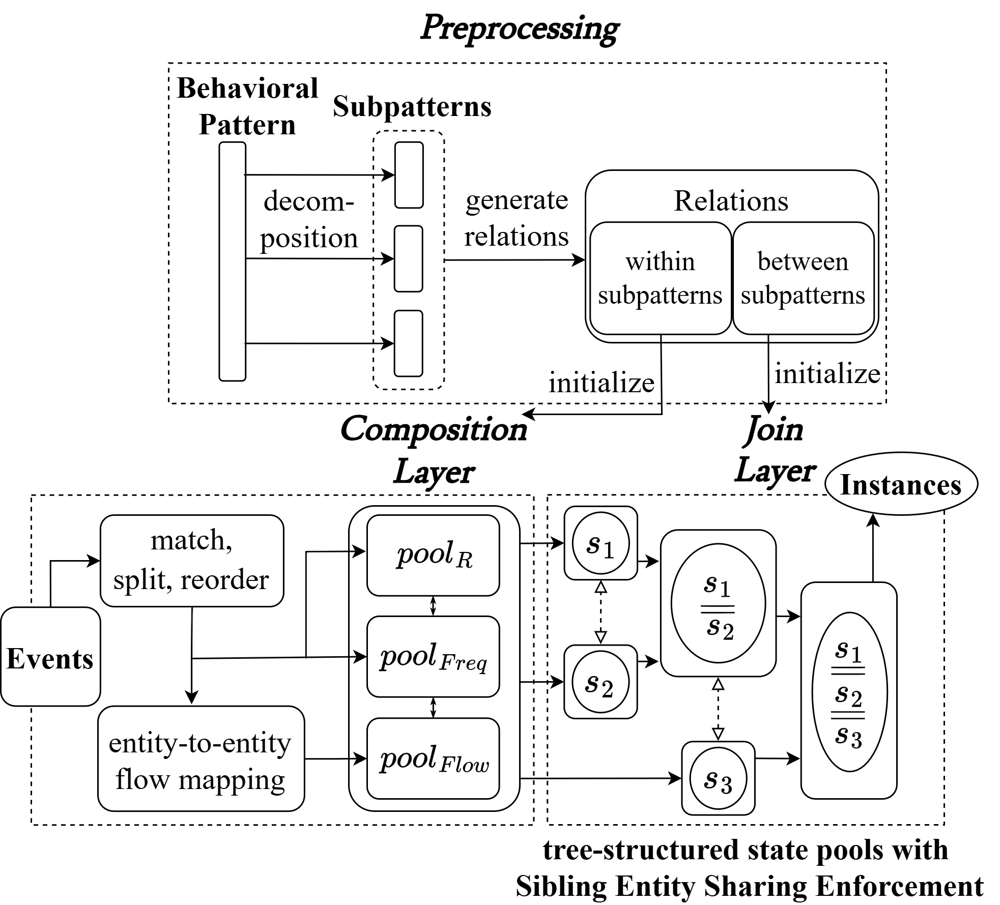

# IPMES

## Overview

* [Introduction (2 human-minute)](#introduction-2-human-minute)
* [Configuration and Installation (1 human-minute, 6 compute-minutes)](#configuration-and-installation-1-human-minute-6-compute-minutes)
    + [Dependency (3 compute-minutes)](#dependency-3-compute-minutes)
    + [Build IPMES+ (3 compute-minutes)](#build-ipmes-3-compute-minutes)
* [Reproduce and Validate Experiment Results (15 human-minutes, 7 compute-days)](#reproduce-and-validate-experiment-results-15-human-minutes-7-compute-days)
    + [Preparation (5 compute-minutes)](#preparation-5-compute-minutes)
    + [Effectiveness of frequency-type event patterns (3 compute-minutes)](#effectiveness-of-frequency-type-event-patterns-sec-ivb-table-iii-3-compute-minutes)
    + [Effectiveness of flow-type event patterns (1 compute-minutes)](#effectiveness-of-flow-type-event-patterns-sec-ivc-table-iv-1-compute-minutes)
    + [Efficiency of matching low-level attack patterns (6 compute-days)](#efficiency-of-matching-low-level-attack-patterns-sec-ivd-figure-8-figure-9-6-compute-days)
    + [Join layer optimization (1 compute-minutes)](#join-layer-optimization-sec-ive-table-v-1-compute-minutes)
* [Execution / How to reuse beyond paper (10 human-minutes, 1 compute-minute)](#execution--how-to-reuse-beyond-paper-10-human-minutes-1-compute-minute)

* [Authors (1 human-minute)](#authors-1-human-minute)

## Introduction (2 human-minute)

**IPMES+** is the successor of the original [IPMES](https://github.com/littleponywork/IPMES), which was developed in 2023. The original IPMES was published in IEEE/IFIP International Conference on Dependable Systems and Networks (DSN) 2024, titled **IPMES: A Tool for Incremental TTP Detection over the System Audit Event Stream (Tool)**.

**IPMES+** is a system that performs incremental pattern matching over event streams.

The core concept of the original IPMES involves decomposing a target behavioral pattern into multiple total-ordered subpatterns (**Preprocessing**), matching and reordering events (**Matching Layer**), composing events against these subpatterns (**Composition Layer**), and then combining subpattern matches into complete instances (**Join Layer**). **IPMES+** retains a similar architecture with key differences:

- Integrate **frequency** and **flow** semantics by extending event pattern types and merging the **Matching Layer** into the **Composition Layer** for efficient support.
- Enhancing event matching and state management through Shared Entity Filtration, Flow Contraction, and Sibling Entity Sharing Enforcement to reduce search space and state explosion.
- Port the prototype from Java to Rust for better memory control and locality.

An overview of **IPMES+** is illustrated in the below figure.



## Configuration and Installation (1 human-minute, 6 compute-minutes)

### Dependency (3 compute-minutes)

- Rust (rustc) >= 1.75.0

Install on Ubuntu/Debian:

```bash
curl --proto '=https' --tlsv1.2 -sSf https://sh.rustup.rs | sh
source "$HOME/.cargo/env"

# vefify installation
rustc -V
```

### Build IPMES+ (3 compute-minutes)

**IPMES+** can be built with a simple command:

```bash
# clone this repository to IPMES_PLUS/
cd IPMES_PLUS/
cargo build --release
```

The first build will take longer due to downloading the dependencies.

## Reproduce and Validate Experiment Results (15 human-minutes, 7 compute-days)

Please refer to [paper_experiments.md](docs/paper_experiments.md).

## Execution / How to reuse beyond paper (10 human-minutes, 1 compute-minute)

### Directory Structure

- `data/`: Example input data for the program.
- `docs/`: Documentations.
- `scripts/`: Helper scripts to carry out expriment and data preprocessing.
- `src/`: Source codes of **IPMES+**.
- `testcases/`: Test data for the experiments and code tests.

### Command-line Syntax

```
IPMES implemented in rust

Usage: ipmes-rust [OPTIONS] <PATTERN_FILE> <DATA_GRAPH>

Arguments:
  <PATTERN_FILE>  The path to the pattern file in json format, e.g. ../data/universal_patterns/SP12.json
  <DATA_GRAPH>    The path to the preprocessed data graph (provenance graph) in csv format

Options:
  -w, --window-size <WINDOW_SIZE>  Window size (sec) [default: 1800]
  -s, --silent                     Enable silent mode will not print individual pattern matches
  -h, --help                       Print help
  -V, --version                    Print version
```

#### Example
- `./target/release/ipmes-rust -w 3600 ../data/universal_patterns/SP12.json ../data/preprocessed/attack.csv`
  - `-w 3600`: Set the window size to be `3600` seconds.
  - `SP12.json`: A pattern for the SPADE dataset. See [data/README.md](data/README.md) for more information.
  - `preprocessed/attack.csv`: Input data graph which is either generated from real-world log data, or is manually synthesized. See [data/README.md](data/README.md) for more information.

### Input Format
See [data/README.md](data/README.md) for more information.

### Output Format
The program output for the [above example](#example) is shown below:

```bash
Pattern Match: <1637229824.000, 1637229824.000>[7109945, 7106314, 7119497, 5109127]
Pattern Match: <1637226496.000, 1637226496.000>[7109521, 7106121, 7119501, 5109128]
Pattern Match: <1637233280.000, 1637233280.000>[7110213, 7106605, 7119505, 5109124]
Pattern Match: <1637244160.000, 1637244160.000>[7111035, 7107489, 7119499, 5109126]
Pattern Match: <1637254912.000, 1637254912.000>[7111777, 7108182, 7119498, 5109122]
Pattern Match: <1637251328.000, 1637251328.000>[7111529, 7107938, 7119500, 5109129]
Pattern Match: <1637262208.000, 1637262208.000>[7112244, 7108669, 7119496, 5109123]
Pattern Match: <1637258496.000, 1637258496.000>[7112003, 7108470, 7119503, 5109121]
Total number of matches: 8
CPU time elapsed: 0.728816059 secs
Peak memory usage: 4096 kB
```

The output message means:

- **Pattern Match**: Each entry of `Pattern Match` denotes a matched instance of the pattern such that they are in the following format: `<StartTime, EndTime>[list of MatchIDs]`, where
    - **StartTime**: The timestamp of the earliest event of this match instance.
    - **EndTime**: The timestamp of the latest event of this match instance.
    - **MatchIDs**: The IDs of the matched input events, whose index in this array corresponds to the pattern event they are matched to. In this example, the first `Pattern Match` entry contains an input event `7109945`, which is located at index 0, and hence it matches the pattern event with ID 0.
- **Total number of matches**: The number of matched instances of the pattern on the data graph.
- **CPU time elapsed**: The CPU time spent for pattern matching.
- **Peak memory usage**: The maximum heap allocation size in kilobytes.

## Authors (1 human-minute)

- Hong-Wei Li (Research Center for Information Technology Innovation, Academia Sinica, Taiwan) <g6_7893000@hotmail.com>
- Ping-Ting Liu (Department of Computer Science, National Yang Ming Chiao Tung University, Taiwan) <xyfc128@gmail.com>
- Bo-Wei Lin (Department of Computer Science, National Yang Ming Chiao Tung University, Taiwan) <0800680274united@gmail.com>
- Yennun Huang (Research Center for Information Technology Innovation, Academia Sinica, Taiwan) <yennunhuang@citi.sinica.edu.tw>
