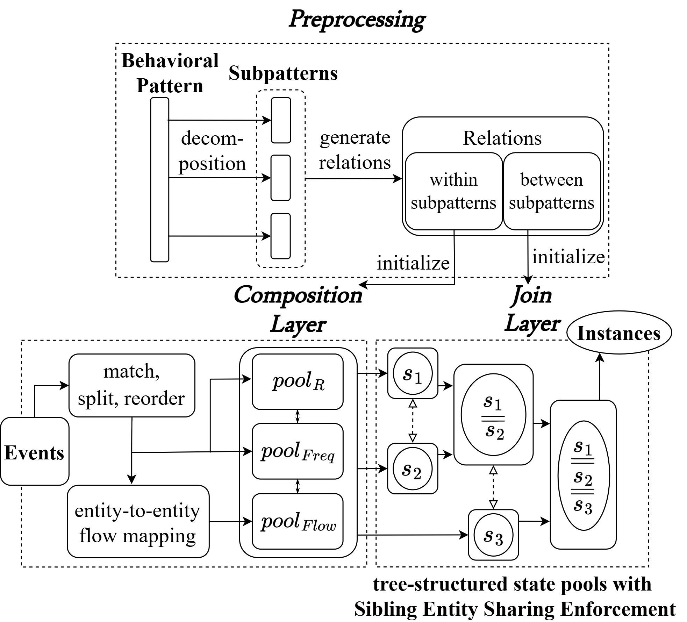

# IPMES+ Artifact Manual

## Overview

## Introduction (1 human-minute)

**IPMES+** is a system that performs incremental pattern matching over audit event streams (provenance graph). It is the successor of the original [IPMES](https://github.com/littleponywork/IPMES).

The core concept of the original IPMES involves decomposing a target behavioral pattern into multiple total-ordered subpatterns (**Preprocessing**), matching and reordering events (**Matching Layer**), composing events against these subpatterns (**Composition Layer**), and then combining subpattern matches into complete instances (**Join Layer**). **IPMES+** retains a similar architecture with key differences:

- Integrate **frequency** and **flow** semantics by extending event pattern types and merging the **Matching Layer** into the **Composition Layer** for efficient support.
- Enhancing event matching and state management through Shared Entity Filtration, Flow Contraction, and Sibling Entity Sharing Enforcement to reduce search space and state explosion.
- Port the prototype from Java to Rust for better memory control and locality.

The simplified flow chart of **IPMES+** is illustrated in the below figure.



### Directory Structure of This Artifact

- `data/`: The input data for our experiments.
- `IPMES_PLUS/`: Source code of **IPMES+**.
- `IPMES/`: Source code of **IPMES** and **IPMES with Siddhi**.
- `timingsubg/`: Modified source code of [Timing](https://github.com/pkumod/timingsubg).
- `experiments.py`: The script to conduct experiments in our paper.
- `requirements.txt`

## Configuration and Installation (2 human-minutes, 10 compute-minutes)

### Experiment Experiment Requirements

The experiment environment requires:

- Unix-like environment (tested on Ubuntu 24.04)
- 15 GB of disk storage: to store experiment data.
- Rust >= 1.71.1: To run IPMES+.
- Python >= 3.6.9: To run experiment automation script.
    - with `pandas` package installed to handle experiment tables
- Java (JDK) >= 11: To run IPMES and Siddhi.
- Apache Maven >= 3.6.0: To build IPMES and Siddhi.
- GNU Make >= 4.3: To build timingsubg
- `g++` >= 11.4.0: To build timingsubg
- patchutils: To patch the source code to compare diffent optimizations.

### Experiment Environment Setup (10 compute-minutes)

Ensure the required packages are installed on your system. For Ubuntu/Debian:

```sh
sudo apt-get update
sudo apt-get install -y patchutils openjdk-11-jdk maven build-essential g++ python3 python3-pandas curl
# Install rust
curl --proto '=https' --tlsv1.2 -sSf https://sh.rustup.rs | sh
source "$HOME/.cargo/env"
```

It is recommended to install packages in python virtual environments like [conda](https://docs.anaconda.com/free/miniconda/index.html), [venv](https://docs.python.org/3/library/venv.html) or [virtualenv](https://virtualenv.pypa.io/en/latest/) to avoid package collisions.


## Reproduce and Validate Experiment Results (15 human-minutes, 14 compute-days)

This section describes how to reproduce the experiment results in our paper.

### Experiment 1: Effectiveness of Frequency-type Event Patterns

This experiment demonstrate the necessity of **frequency-based** event patterns across different patterns on the unaggregated dataset `attack_raw`.

Resource usage of this experiment:

- Peak Memory Usage: 60 GB
- Estimated CPU Time: 100 seconds

The following command conducts the experiment automatically. The script will output a table similar to **Table III** in the paper. For transparency, the script will also print out the command it is currently running.

```sh
python3 experiments.py freq
```

Example output:

```
*** Building applications... ***
*** Building finished. ***
Running: `IPMES_PLUS/target/release/ipmes-rust IPMES_PLUS/data/universal_patterns/SP2_regex.json
 data_graphs/attack_raw.csv -w 1800 --silent`
Run 1 / 1 ...
Total number of matches: 1058
CPU time elapsed: 0.932406222 secs
Peak memory usage: 68608 kB

Running: `IPMES_PLUS/target/release/ipmes-rust IPMES_PLUS/data/freq_patterns/SP2_regex.json
 data_graphs/attack_raw.csv -w 1800 --silent`
Run 1 / 1 ...
...
  Pattern  Found Ins.  CPU Time (sec)  Peak Memory (MB)
      SP2        1058        0.979761          67.00000
      SP3      195000       74.673155       48068.34375
      SP4           0        1.199713         149.00000
      SP6           9        0.986092          67.00000
      SP7       53218        2.315620          67.00000
     SP10         993        1.009373          67.00000
     SP11          36        0.940848          67.00000
 SP2_freq          25        0.962850          67.00000
 SP3_freq           1        1.072686          67.00000
 SP4_freq           0        1.005105          67.00000
 SP6_freq           4        0.984637          67.00000
 SP7_freq         419        1.070710          67.00000
SP10_freq           9        0.978941          67.00000
SP11_freq          18        0.967783          67.00000
This table is saved to results/freq_result.csv
```

### Experiment 2: Effectiveness of Flow-type Event Patterns

This experiment demonstrate the necessity of **flow-based** event patterns across different patterns on our manually modified `attack` and `dd3` datasets to simulate attack path shift.

Resource usage of this experiment:

- Peak Memory Usage: 250 MB
- Estimated CPU Time: 15 seconds

The following command conducts the experiment automatically. The script will output a table similar to **Table IV** in the paper. For transparency, the script will also print out the command it is currently running.

```sh
python3 experiments.py flow
```

Example output:

```
*** Building applications... ***
*** Building finished. ***
Running: `IPMES_PLUS/target/release/ipmes-rust IPMES_PLUS/data/universal_patterns/SP3.json
 modified_data_graphs/attack.csv -w 1800 --silent`
Run 1 / 1 ...
Total number of matches: 0
CPU time elapsed: 0.837500926 secs
Peak memory usage: 68608 kB

Running: `IPMES_PLUS/target/release/ipmes-rust IPMES_PLUS/data/flow_patterns/SP3.json
 modified_data_graphs/attack.csv -w 1800 --silent`
Run 1 / 1 ...
Total number of matches: 2
CPU time elapsed: 2.37848033 secs
Peak memory usage: 72004 kB

Running: `IPMES_PLUS/target/release/ipmes-rust IPMES_PLUS/data/universal_patterns/DP3.json
 modified_data_graphs/dd3.csv -w 1000 --silent`
Run 1 / 1 ...
Total number of matches: 0
CPU time elapsed: 3.822604907 secs
Peak memory usage: 68608 kB

Running: `IPMES_PLUS/target/release/ipmes-rust IPMES_PLUS/data/flow_patterns/DP3.json
 modified_data_graphs/dd3.csv -w 1000 --silent`
Run 1 / 1 ...
Total number of matches: 4
CPU time elapsed: 10.012387877 secs
Peak memory usage: 249008 kB

 Pattern  Found Ins.  CPU Time (sec)  Peak Memory (MB)
     SP3           0        0.837501         67.000000
     DP3           0        3.822605         67.000000
SP3_flow           2        2.378480         70.316406
DP3_flow           4       10.012388        243.171875
This table is saved to results/flow_result.csv
```

### Experiment 3: Efficiency of Matching Low-level Attack Patterns

This experiment compares the efficiency of matching low-level event patterns across **IPMES+**, **IPMES**, **Timing**, and **Siddhi**.

Resource usage of this experiment:

- Peak Memory Usage: 76 GB
- Estimated CPU Time: 340 hours (some data points runs significantly slower than others, see the description below)

Some data points requires significantly more time or memory to collect. These data points are:

- timing on DARPA dataset (dd1-dd4) runs for 140 hours in total
- siddhi on DARPA dataset (dd1-dd4) runs for 192 hours in total
- dd4 dataset requires 76 GB of memory for timing to run and requires few days for **Timing** and **Siddhi** to complete.

The following command conducts the experiment automatically. The script will ask you for apps and datasets to run so you can avoid running those resource intensive data points. Hit enter to select all apps and datasets or select the item with the example syntax printed by the script.

It will output a table that corresponds to **Figure 8** and **Figure 9** in our paper. For transparency, the script will also print out the command it is currently running.

```sh
python3 experiments.py efficiency
```

Example output:

```
*** Building applications... ***
*** Building finished. ***

Apps:
[1]: ipmes+
[2]: timing
[3]: ipmes
[4]: siddhi
Select apps to run (eg: "1 2 3", "1 2-4", default: "1-4"):

Datasets:
[1]: attack
[2]: mix
[3]: benign
[4]: dd1
[5]: dd2
[6]: dd3
[7]: dd4
Select datasets to run (eg: "1 2 3", "1 2-4", default: "1-7"):

Running: `IPMES_PLUS/target/release/ipmes-rust IPMES_PLUS/data/universal_patterns/SP1_regex.json
 data_graphs/attack.csv -w 1800 --silent`
Run 1 / 1 ...
...
Average CPU Time (sec)
Dataset   ipmes+     ipmes      timing    siddhi
 attack 0.827590  9.579167   55.618900 15.400833
    mix 1.169838 10.596667 1403.702995 21.330000
 benign 0.305944  6.814167   98.533342 33.084167
 ...
This table is saved to results/efficiency_cpu.csv

Average Peak Memory Usage (MB)
Dataset  ipmes+       ipmes     timing  siddhi
 attack    89.0 2064.000000 560.333333  1620.0
    mix    89.0 2064.000000 771.416667  1756.0
 benign    89.0 2194.666667 205.750000  1580.0
 ...
This table is saved to results/efficiency_memory.csv
```

Additionally, to speedup the experiment process, you can spwan multiple process to collect multiple data points simultaneously by the `-j` argument:

```sh
python3 experiment.py efficiency -j 4
```

This will run 4 app instances parallelly. Do note that running apps parallelly increases the memory consumption and may affect the CPU time measurement depending on the hardware condition.

### Experiment 4: Join Layer Optimization

This experiment highlights the effectiveness of **sibling entity
sharing enforcement** for **IPMES+**. We have synthesized worst-case provenance graphs exclusively containing pattern instances for this experiment.

Resource usage of this experiment:

- Peak Memory Usage: 70 MB
- Estimated CPU Time: 1 seconds

The following command conducts the experiment automatically. The script will output a table that corresponds to **Figure 8** and **Figure 9** in the paper. For transparency, the script will also print out the command it is currently running.

```sh
python3 experiments.py join
```

Example output:

```
*** Building applications... ***
*** Building finished. ***
patching file ./join_layer/sub_pattern_buffer.rs
patching file ./join_layer.rs
Running: `IPMES_PLUS/target/release/ipmes-rust IPMES_PLUS/data/universal_patterns/SP6_regex.json data/synthesized_graphs/DW10.csv -w 1800`
Run 1 / 1 ...
Total number of matches: 10
CPU time elapsed: 0.012617745 secs
Peak memory usage: 68608 kB
...
Running: `IPMES_PLUS/target/release/ipmes-rust IPMES_PLUS/data/universal_patterns/SP6_regex.json data/synthesized_graphs/DW50.csv -w 1800`
Run 1 / 1 ...
Total number of matches: 50
CPU time elapsed: 0.00499456 secs
Peak memory usage: 68608 kB

Before optimization:
Synthesized Graph  Num Results Num States  CPU Time (sec)  Peak Memory (MB)
             DW10           10       1396        0.012618              67.0
             DW20           20       9289        0.277663              67.0
             DW30           30      29732        2.067948              67.0
             DW40           40      68881       10.057189              67.0
             DW50           50     132130       26.302930              67.0
This table is saved to results/join_optim_before.csv
After optimization:
Synthesized Graph  Num Results Num States  CPU Time (sec)  Peak Memory (MB)
             DW10           10        137        0.000776              67.0
             DW20           20        266        0.001488              67.0
             DW30           30        402        0.002556              67.0
             DW40           40        547        0.003691              67.0
             DW50           50        672        0.004995              67.0
This table is saved to results/join_optim_after.csv
```

## Execution / How to reuse beyond paper (10 human-minutes, 3 compute-minute)

### Build IPMES+ (3 compute-minutes)

The only build dependencies of **IPMES+** is rust compiler and `cargo`, which can be install with the following commands on linux:

```shell
curl --proto '=https' --tlsv1.2 -sSf https://sh.rustup.rs | sh
source "$HOME/.cargo/env"

# vefify installation
rustc -V
```

Get the latest version of **IPMES+** and build it:

```bash
git clone https://github.com/XYFC128/IPMES_PLUS.git
cd IPMES_PLUS/
cargo build --release
```

The output binary is located in `target/release/ipmes-rust`. The first build will take longer due to downloading the dependencies.

### Command-line Syntax

```
IPMES implemented in rust

Usage: ipmes-rust [OPTIONS] <PATTERN_FILE> <DATA_GRAPH>

Arguments:
  <PATTERN_FILE>  The path to the pattern file in json format, e.g. data/universal_patterns/SP12.json
  <DATA_GRAPH>    The path to the preprocessed data graph (provenance graph) in csv format

Options:
  -w, --window-size <WINDOW_SIZE>  Window size (sec) [default: 1800]
  -s, --silent                     Enable silent mode will not print individual pattern matches
  -h, --help                       Print help
  -V, --version                    Print version
```

#### Minimal Running Example

- `./target/release/ipmes-rust -w 1800 data/paper/behavioral_pattern.json data/paper/data_graph.csv`
    - `-w 1800`: Set the time window size to be `1800` seconds.
    - `data/paper/behavioral_pattern.json`: An example pattern used in our paper. See the section below for more information.
    - `data/paper/data_graph.csv`: Input data graph to search for pattern. See the section below for its format.
    - Make sure the current working directory is the cloned soruce code of **IPMES+** (`IPMES_PLUS/`).

### Output Format

The program output for the [above example](#minimal-running-example) is shown below:

```
Pattern Match: <5.000, 11.000>[(1 -> 3), (3, 5), (4, 6)]
Total number of matches: 1
CPU time elapsed: 0.000108047 secs
Peak memory usage: 8604 kB
```

The output message contains:

- Zero or multiple lines of **Pattern Match**: Each entry of `Pattern Match` denotes a matched instance of the pattern such that they are in the following format: `<StartTime, EndTime>[MatchEventList...]`, where
    - **StartTime**: The timestamp of the earliest event of this match instance.
    - **EndTime**: The timestamp of the latest event of this match instance.
    - **MatchEventList**: A comma seperated list of the matched input events, whose index in this array corresponds to the pattern event they are matched to.
        - If the corresponding pattern event is a **flow event**, it will be in the format `(StartEntityID -> EndEntityID)`. In this example, the pattern event 0 is a flow pattern, and IPMES+ found the flow from entity 1 to entity 3 that matches the pattern event.
        - If the corresponding pattern is a **frequency event**, the match id format is `(EventID, ...)`. The numbers in the parentheses is a list of matched input event IDs for that frequency pattern event. In this example, the pattern event 1 is a frequency event, and input event 3 and 5 both match that frequency event.
        - If the corresponding pattern is a normal regex pattern, the match id is simply the ID of the matched input event.
- **Total number of matches**: The number of matched instances of the pattern on the data graph.
- **CPU time elapsed**: The CPU time spent for pattern matching.
- **Peak memory usage**: The maximum total system memory usage in kilobytes.

### Input Format

**IPMES+** takes 2 files as input: The **pattern description file** and the **data graph file**. **IPMES+** will search for pattern in the data graph.

#### Data Graph File Format

The data graph is a streaming provenance graph where each line is an audit event. We use normal file in our experiments, but it can also be an UNIX PIPE to support ture streaming input. An event in provenance graph is associated with 2 entities: the subject that initiates the event and the object affected by the event.

An event is given by a CSV format in each line of the input data graph. The columns in this CSV format are: [`start_time`, `end_time`, `event_id`, `event_sig`, `subject_id`, `subject_sig`, `object_id`, `object_sig`], which represents:

- `start_time`: the event start time in seconds. e.g. `5.000`
- `end_time`:   the event end time in seconds. e.g. `10.000`
- `event_id`:   the numerical event id
- `event_sig`: the event signature string
- `subject_id`: the subject entity numerical id
- `subject_sig`: the subject signature string
- `object_id`:  the object numerical id
- `object_sig`: the object signature string

See `data/paper/data_graph.csv` for example.

#### Pattern File Format

A pattern describes a subgraph of the data graph by specifying the signature of events and entities of the subgraph. **IPMES+** additionally support flow and frequency event pattern to match high-level event patterns. The format of pattern description file is in this [JSON](https://www.json.org) scheme:

```json
{
  "Version": "0.2.0",
  "UseRegex": true,
  "Entities": [
    {
      "ID": 1,
      "Signature": "Socket::ip::.*"
    },
    {
      "ID": 2,
      "Signature": "Process::name::.*"
    },
    {
      "ID": 3,
      "Signature": "File::path::/.*/crontabs/root"
    }
  ],
  "Events": [
    {
      "ID": 1,
      "Type": "Flow",
      "SubjectID": 1,
      "ObjectID": 2,
      "Parents": []
    },
    {
      "ID": 2,
      "Signature": "read",
      "Type": "Frequency",
      "Frequency": 2,
      "SubjectID": 3,
      "ObjectID": 2,
      "Parents": [
        1
      ]
    },
    {
      "ID": 3,
      "Signature": "write",
      "Frequency": 2,
      "SubjectID": 2,
      "ObjectID": 3,
      "Parents": [
        1
      ]
    }
  ]
}
```

- `Version`: the version of the pattern format, the latest version is `0.2.0`.
- `UseRegex`: the `Signature` in this pattern is supposed to be treated as regex expressions. We use the regex crate to handle regex expresions, the supported regex syntax can be found [here](https://docs.rs/regex/latest/regex/#syntax).
- `Entities`: an array of **Pattern Entity Object**.
- `Events`: an array of **Pattern Event Object**.

**Pattern Entity Object**:

- `ID`: the unique id of this pattern entity.
- `Signature` the signature of this pattern entity. It will match input entities in data graph with the same signature. 

**Pattern Event Object**:

- `ID`: the unique id of this pattern event.
- `Type`: `Default`, `Frequency` or `Flow`.
    - `Default`: The default event pattern that matches the input event with the signature specified in `Signature`. If `UseRegex` is set to `true`, the signature will be treated as a regex expression to match the signatures of input events in the data graph. Can ignore `Type` for default event pattern.
    - `Frequency`: Similar to the default event pattern except it must be matched $f$ times to count as a frequency pattern match (i.e. there must be at least $f$ events in data graph that matches the signature of this pattern event). The parameter $f$ is specifed by the `Frequency` attribute of this event.
    - `Floe`: This pattern event has no signature. It finds a flow from the entity matches its subject pattern to the entity matches its object pattern.
- `SubjectID`: the subject of this event. If 2 events are arise from the same subject, they share the subject id.
- `ObjectID`: the object of this event. If 2 events act on the same object, they share the object id.
- `Parents`: an array of pattern event id. This determins the dependency of a pattern event. The pattern event should be matched after all of its parents are matched.

### Directory Structure of Our Source Code

The directory structure of `IPMES_PLUS/`:

- `data/`: Example input data for the program. Check `data/README.md` for more information.
- `docs/`: Documentations.
- `scripts/`: Helper scripts to carry out expriment and data preprocessing. Check `scripts/README.md` for more information.
- `src/`: Source codes of **IPMES+**. Document are written as code comments.
- `testcases/`: Test data for the experiments and code tests.


## Authors (1 human-minute)

- Hong-Wei Li (Research Center for Information Technology Innovation, Academia Sinica, Taiwan) <g6_7893000@hotmail.com>
- Ping-Ting Liu (Department of Computer Science, National Yang Ming Chiao Tung University, Taiwan) <xyfc128@gmail.com>
- Bo-Wei Lin (Department of Computer Science, National Yang Ming Chiao Tung University, Taiwan) <0800680274united@gmail.com>
- Yennun Huang (Research Center for Information Technology Innovation, Academia Sinica, Taiwan) <yennunhuang@citi.sinica.edu.tw>